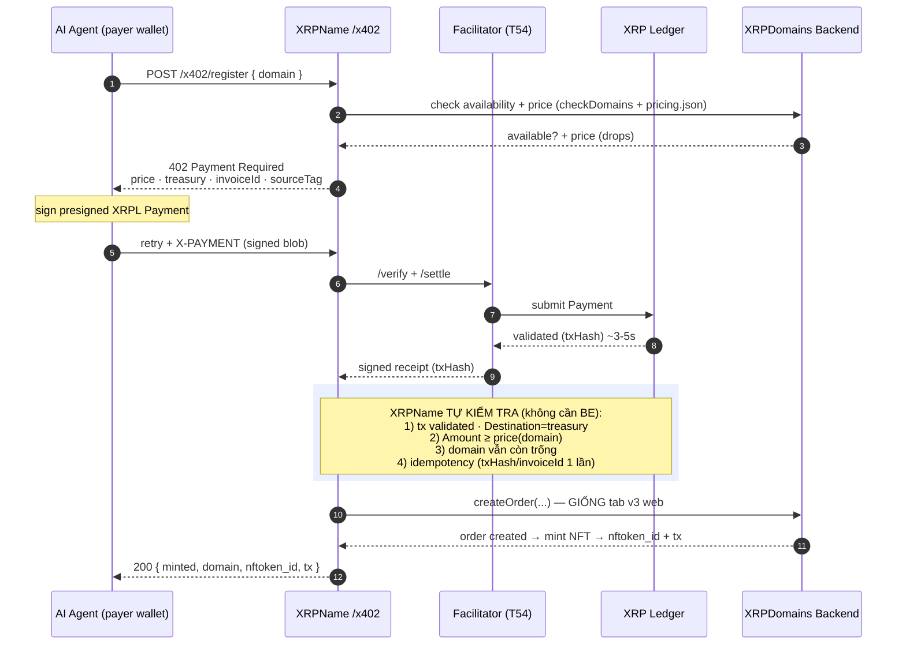

# x402 Agentic Domain Registration — Backend flow (XRP first)

Luồng để AI agent tự **mua/đăng ký domain** qua giao thức **x402** (thanh toán HTTP máy‑với‑máy) trên XRPL. Giai đoạn 1 dùng **XRP**; RLUSD làm sau.

Nguyên tắc: **không giữ private key của ai** — agent tự ký Payment; facilitator (T54) no‑custody chỉ verify + settle. **XRPName tự lo toàn bộ khâu kiểm tra**, sau đó gọi **`createOrder` y như tab XRPName v3 đang làm** → Backend **không cần endpoint mới**.

## Sequence



## Phân chia trách nhiệm

### XRPName tự làm (không cần BE hỗ trợ)
Sau khi facilitator trả receipt, XRPName tra `txHash` trên XRPL (đã có `xrpl-client`) và kiểm:
1. Tx đã **validated**, `Destination = treasury`.
2. `Amount ≥ price(domain)` (giá từ `pricing.json`).
3. Domain **vẫn còn trống** (gọi lại `checkDomains` — chống race).
4. **Idempotency**: mỗi `txHash`/`invoiceId` chỉ xử lý **1 lần**.

Nếu tất cả OK → sang bước dưới. Nếu domain đã bị mua sau khi trả tiền → trả lỗi + xử lý refund (cần chốt policy).

### Backend: chỉ cần cho gọi `createOrder` như v3
XRPName gọi **đúng `createOrder`** mà tab XRPName v3 (web) đang dùng khi đăng ký. Không cần endpoint mới, không cần BE verify lại (XRPName đã verify).

**Cái duy nhất cần từ BE/v3:** hợp đồng gọi `createOrder` — cụ thể:
- Đường dẫn + method + **payload chính xác** (domain, payer/owner, txHash/payment ref, price…).
- **Auth** gọi server‑to‑server (v3 web gọi kèu token/session gì? XRPName cần gọi được từ backend của nó).
- Response shape (order id / nftoken_id / trạng thái).

→ Chỉ cần chỉ cho cháu **file v3 gọi `createOrder`** (vd trong `v3/js/...`) hoặc dán 1 request mẫu, cháu ráp thẳng vào `/x402/register`.

## Ngoài phạm vi giai đoạn 1
- **RLUSD**: thêm asset sau (cần trustline payer + quy đổi USD qua `rate_sources`). 402 sẽ chào cả XRP + RLUSD.
- **x402-secure / Trustline (KYA)**: bật sau cho chống spam khi giá trị cao.
- **Refund policy**: quy tắc hoàn tiền khi domain hết chỗ sau khi đã thanh toán — cần BE + treasury thống nhất.

## Decisions (locked 2026-08-07)

1. **AcceptOffer**: whoever paid may also sign `NFTokenAcceptOffer` → the agent
   (buyer = payer) completes the flow itself. `/x402/register` returns
   `offer_id` + a ready-to-sign AcceptOffer template; the agent signs it. No key
   is ever held by XRPName or the backend.
2. **Auth**: XRPName calls `createOrder` server-to-server; auth handled on the
   XRPName server side. No extra token mechanism required from BE.
3. **Network**: **MAINNET** from the start (network=`MAINNET`, mainnet contract
   wallet + base_uri, T54 mainnet facilitator).
4. **Transport**: standard **x402 via T54 facilitator** (not direct-pay) — so any
   x402-compatible agent integrates, and the flow is auditable. `createOrder`
   remains the final fulfillment step.

### Resulting flow (final)

```
Agent → POST /x402/register {domain}
  → 402 { price(drops from pricing.json − global_discount), payTo=contract wallet,
          facilitator=xrpl-facilitator-mainnet.t54.ai, invoiceId, sourceTag }
Agent signs presigned XRPL Payment → T54 /verify + /settle → receipt(txHash)
XRPName verifies: validated · Destination=contract wallet · Amount ≥ price ·
                  domain still free · idempotency(txHash/invoiceId once)
XRPName → POST /api/xrplnft/createOrder  (full body §2, adapter="x402",
          isVerify=true, network="MAINNET", buyer=owner=agent addr)
  → { nftoken_id, offer_id, mint_tx }
XRPName → GET /api/domains/add2Queue (fire-and-forget) → Telegram admin ping  [handoff §10]
XRPName → Agent: 200 { minted, nftoken_id, offer_id, accept_offer_template }
Agent signs NFTokenAcceptOffer(offer_id) → tesSUCCESS → NFT in agent wallet ✅
```

**Safety note (mainnet, real funds):** first live runs should use a low-price
domain, verify refund path on `DOMAIN_TAKEN`, and confirm idempotency before any
public exposure. AcceptOffer must be surfaced clearly so the agent always
completes step 2 (else the NFT sits in an unaccepted sell offer for 365 days).

## Design rationale — pay-first, and two XRPL use-cases

XRPL cannot mint an NFT directly into another wallet: `NFTokenMint` always mints
into the submitting account, and transferring to a buyer REQUIRES the buyer to
sign `NFTokenAcceptOffer` (you can't push an NFT onto an unconsenting account).
So the 2-signature flow (Payment + AcceptOffer) is **inherent to XRPL**, not a
backend choice — it cannot be removed. Two distinct patterns follow:

- **Register a NEW domain (mint-on-demand)** — this flow. The NFT does not exist
  until someone registers, so we **pay first, then mint**. Pre-minting is wrong:
  it mints speculatively before payment → orphaned NFTs (garbage) that also lock
  the platform's owner-reserve XRP. Pay-first costs one extra signature but keeps
  data clean. ✅
- **Buy an EXISTING NFT/domain (secondary market)** — different: the NFT already
  exists behind a *priced* sell offer, so the buyer signs ONE `NFTokenAcceptOffer`
  that pays + transfers atomically. No x402, no second step. Do NOT reuse this
  x402-register flow for secondary sales.

## Roadmap (record — do XRPName FIRST)

The pay-first → mint-on-demand → accept pattern is **issuer-agnostic**: it fits
any XRPL NFT publisher that mints on demand (art, tickets, memberships, game
assets, RWA), not just domains. `/mcp/x402/register` is therefore built as a
generic **"XRPL x402 Mint Gateway"**: a fixed core (402 → facilitator → mint →
accept template → notify) plus a per-issuer **MintAdapter** (validate + price +
mint call + accept template + admin ping).

**Implemented (2026-08-08):**
- `src/lib/mint-adapter.ts` — the `MintAdapter` interface (issuer contract).
- `src/adapters/xrpdomains-adapter.ts` — first adapter (domain validation,
  pricing.json, v3 `createOrder`, Telegram ping, AcceptOffer template).
- `src/routes/x402-register.ts` — issuer-agnostic gateway; selects the adapter.

Adding a second issuer = write another adapter + select it in the route; no core
edits. Step 1 remains: ship XRPName domain registration solidly (deploy + one
live buy via the T54 facilitator) before wiring a second adapter.

## Facilitator wire contract (verified vs x402-xrpl@0.3.1 FacilitatorClient)

```
POST {facilitator}/verify   { paymentPayload, paymentRequirements }
  → { isValid: boolean, invalidReason?, payer? }
POST {facilitator}/settle   { paymentPayload, paymentRequirements }
  → { success: boolean, transaction, network, payer?, errorReason? }
```

- `paymentPayload` = decoded PAYMENT-SIGNATURE (`{ x402Version, accepted, payload:{ signedTxBlob } }`).
- `paymentRequirements` = the SERVER's terms (payTo/amount/sourceTag we demanded),
  carrying the CLIENT's `invoiceId` so the on-chain binding matches. Passing the
  client-echoed copy would defeat amount/destination/requirements-mismatch checks.
- Earlier bug: we POSTed the bare signature object and parsed `valid`/`success`
  only → facilitator returned `verify_failed`. Fixed in `src/lib/x402.ts`.

## Tham chiếu
- x402 trên XRPL (chính thức): https://xrpl.org/docs/agents/agentic-payments-x402
- Facilitator T54 (mainnet `xrpl-facilitator-mainnet.t54.ai`, TS/Express client): https://xrpl-x402.t54.ai/docs
- `createOrder` contract: `docs/createOrder-x402-handoff.md`
